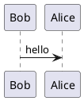

# plantuml-markdown-docker

This wraps [mikitex70/plantuml-markdown](https://github.com/mikitex70/plantuml-markdown/)
and `py-gfm` into an alpine docker image.

# Pull

```
docker pull hugojosefson/plantuml-markdown
```

# Building

Build docker images.

```
docker build -t hugojosefson/plantuml-markdown .
```

# Usage
Render `README.md` as html using docker container.

```
cat README.md |docker run --rm -i hugojosefson/plantuml-markdown > README.html
```

# Tests

The unit tests are executed during image build but you might want to run them
again.

```
docker run -it --rm hugojosefson/plantuml-markdown python -m unittest discover -v -s /app/test
```

# Sample plantuml
---------------


# Sample GitHub Flavoured Markdown
---------------
```markdown
 - [ ] todo
 - [x] done
```

