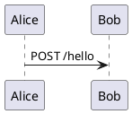

# hugojosefson/markdown

Renders markdown syntax to html syntax.

# Usage

Pipe html contents into the process, and you will get html as output.

## Examples

Render `README.md` as html using this Docker container:

```bash
cat README.md | docker run --rm -i hugojosefson/markdown > README.html
```

Explore the Docker image manually:

```bash
docker run --rm -it --entrypoint=bash hugojosefson/markdown
```

## Configuration

Optional environment variable(s) to set via `docker run --env ...`:

| name                   | value    | consequence                                                                                                                                                                                       |
|:-----------------------|:---------|:--------------------------------------------------------------------------------------------------------------------------------------------------------------------------------------------------|
| `LINK_README_TO_INDEX` | `"true"` | Renames relative links to files named `README.md` or `README.markdown` (case-insentitive) to `index.html`. You must output rendering of `README.md` files, to files named `index.html`, yourself. |
| `LINK_INDEX_TO_DIR`    | `"true"` | Renames relative links to files named `index.html` (case-insentitive) to just the directory they are in. Use this to get nicer looking links, if your web server supports it.                     |

# Sample content

## Sample plantuml



## Sample GitHub Flavoured Markdown

```markdown
 - [ ] todo
 - [x] done
```

...becomes...

- [ ] todo
- [x] done

---

*Acknowledgements: This project wraps
[mikitex70/plantuml-markdown](https://github.com/mikitex70/plantuml-markdown/)
and `py-gfm` into an alpine docker image. I forked this from
[kerhac/plantuml-markdown-docker](https://github.com/kerhac/plantuml-markdown-docker).*
