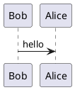

# plantuml-markdown-docker

This wraps [mikitex70/plantuml-markdown](https://github.com/mikitex70/plantuml-markdown/)
into a alpine docker container.

# Pull

```
docker pull kerhac/plantuml-markdown
```

# Building

Build docker images.

```
docker build -t kerhac/plantuml-markdown .
```

# Usage
Render `README.md` as html using docker container.

```
cat README.md |docker run --rm --interactive kerhac/plantuml-markdown > README.html
```

# Tests

The unittest are executed during image build but you might want to run them
again.

```
docker run -it --rm kerhac/plantuml-markdown  python -m unittest discover -v -s /app/test
```

# Sample plantuml
---------------


