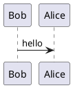

# plantuml-markdown-docker

This wraps [mikitex70/plantuml-markdown](https://github.com/mikitex70/plantuml-markdown/) and `py-gfm` into an alpine docker image. This is forked from [kerhac/plantuml-markdown-docker](https://github.com/kerhac/plantuml-markdown-docker).

# Usage

Render `README.md` as html using this Docker container.

```bash
cat README.md | docker run --rm -i hugojosefson/plantuml-markdown > README.html
```

Explore the Docker image manually:

```bash
docker run --rm -it --entrypoint=sh hugojosefson/plantuml-markdown
```

# Building

Build the Docker image.

```bash
docker build -t hugojosefson/plantuml-markdown .
```

# Tests

The unit tests are executed during image build but you might want to run them again.

```bash
docker run -it --rm hugojosefson/plantuml-markdown python -m unittest discover -v -s /app/test
```

# Sample plantuml
---------------


# Sample GitHub Flavoured Markdown
---------------
```markdown
 - [ ] todo
 - [x] done
```

...becomes...

 - [ ] todo
 - [x] done

