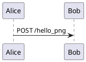
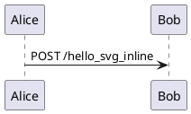
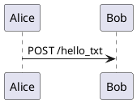

# docker.io/hugojosefson/markdown

Renders markdown syntax to html syntax.

# Usage

Pipe html contents into the process, and you will get html as output.

## Examples

Render `README.md` as html using this Docker container:

```bash
cat README.md | docker run --rm -i docker.io/hugojosefson/markdown > README.html
```

Explore the Docker image manually:

```bash
docker run --rm -it --entrypoint=bash docker.io/hugojosefson/markdown
```

## Configuration

Optional environment variable(s) to set via `docker run --env ...`:

| name                   | value    | consequence                                                                                                                                                                                       |
| :--------------------- | :------- | :------------------------------------------------------------------------------------------------------------------------------------------------------------------------------------------------ |
| `LINK_README_TO_INDEX` | `"true"` | Renames relative links to files named `README.md` or `README.markdown` (case-insentitive) to `index.html`. You must output rendering of `README.md` files, to files named `index.html`, yourself. |
| `LINK_INDEX_TO_DIR`    | `"true"` | Renames relative links to files named `index.html` (case-insentitive) to just the directory they are in. Use this to get nicer looking links, if your web server supports it.                     |

# Sample content

## Sample plantuml


```plantuml
@startuml
Alice -> Bob : POST /hello_png
@enduml
```


```plantuml format="svg_inline"
@startuml
Alice -> Bob : POST /hello_svg_inline
@enduml
```


```plantuml format="txt"
@startuml
Alice -> Bob : POST /hello_txt
@enduml
```

## Sample GitHub Flavoured Markdown

```markdown
- [ ] todo
- [x] done
```

...becomes...

- [ ] todo
- [x] done

## Development

`make test` builds `docker.io/hugojosefson/markdown:latest`; the default Docker
build renders [README.md](README.md), [fixture.md](fixture.md), and
[link-rewriting.md](link-rewriting.md), then fails with a unified diff if an
expected HTML fixture differs. The focused link fixture enables both
link-rewriting environment variables. Run `make fixtures` to render expected
files with the pre-test runtime, then verify the default build. Run
`make gh-api-fixtures` to refresh the GitHub API comparison files using existing
`gh` authentication.

[github-markdown.css](github-markdown.css) vendors
[github-markdown-css v5.9.0](https://github.com/sindresorhus/github-markdown-css/releases/tag/v5.9.0),
including its automatic light/dark `prefers-color-scheme` support. Run
`make update-css` to retrieve and checksum-verify that pinned release tag,
update the version record, and rebuild [wrap_end.html](wrap_end.html)
atomically. Review the resulting diff before changing the version or checksum in
[update-css.sh](update-css.sh).

Third-party license and notice provenance is recorded in
[third-party-license-sources.tsv](third-party-license-sources.tsv). Run
[`./download-third-party-licenses.sh --notices-only`](download-third-party-licenses.sh)
to download the notice set for review, or omit `--notices-only` to also download
the listed source archives. The script verifies every download against its
recorded SHA-256 and refuses to overwrite a changed review file.

The image stores the project license at `/usr/share/licenses/markdown/LICENSE`
and the approved dependency notices in
`/usr/share/licenses/markdown/THIRD_PARTY_NOTICES/`.

`make test` includes source-artifact tests. Run
`make source-inventory SOURCE_IMAGE=IMAGE@sha256:DIGEST` to query APK v3
metadata from a published multi-platform index without collecting source files.
A native local build does not provide both platforms.
`source-artifact.sh collect IMAGE@sha256:DIGEST vX.Y.Z OUTPUT --dry-run`
validates the immutable subject and prints the collection plan.
[SOURCE.md](SOURCE.md) documents OCI retrieval.

## Release

Pull requests and pushes build and test the image. A semantic version tag
publishes `docker.io/hugojosefson/markdown` to Docker Hub with semantic tags and
`latest`, plus an SBOM and provenance attestation. Publishing uses the
`DOCKERHUB_USERNAME` and `DOCKERHUB_TOKEN` GitHub secrets.

The release job also attaches a corresponding-source OCI artifact to the image
index and tags it as `source-vX.Y.Z` and `source-sha256-<64-hex-digest>`. It
stores each source archive or sdist in a separate OCI layer, allowing unchanged
blobs to be reused across releases. It uses the existing Docker login
configuration for ORAS. Source collection runs after runtime publication, so a
collection or attachment error fails the job while the runtime image may already
be published.

_Acknowledgements: This project wraps
[mikitex70/plantuml-markdown](https://pypi.org/project/plantuml-markdown/),
[markdown-checklist](https://pypi.org/project/markdown-checklist/),
[pymdown-extensions](https://pypi.org/project/pymdown-extensions/),
[Pygments](https://pypi.org/project/Pygments/), and
[github-markdown-css](https://github.com/sindresorhus/github-markdown-css) into
an alpine docker image. I forked this originally from
[kerhac/plantuml-markdown-docker](https://github.com/kerhac/plantuml-markdown-docker)._
