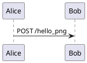
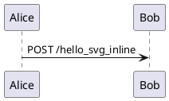
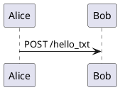

# docker.io/hugojosefson/markdown

Renders markdown syntax to html syntax.

# Usage

Pipe html contents into the process, and you will get html as output.

## Examples

Render `README.md` as html using this [Docker](https://www.docker.com/)
container:

```bash
cat README.md | docker run --rm -i docker.io/hugojosefson/markdown > README.html
```

Explore the [Docker](https://www.docker.com/) image manually:

```bash
docker run --rm -it --entrypoint=bash docker.io/hugojosefson/markdown
```

## Configuration

Optional environment variable(s) to set via `docker run --env ...`:

| name                   | value    | consequence                                                                                                                                                                                       |
| :--------------------- | :------- | :------------------------------------------------------------------------------------------------------------------------------------------------------------------------------------------------ |
| `LINK_README_TO_INDEX` | `"true"` | Renames relative links to files named `README.md` or `README.markdown` (case-insentitive) to `index.html`. You must output rendering of `README.md` files, to files named `index.html`, yourself. |
| `LINK_INDEX_TO_DIR`    | `"true"` | Renames relative links to files named `index.html` (case-insentitive) to just the directory they are in. Use this to get nicer looking links, if your web server supports it.                     |

# Sample content

## Sample PlantUML

These examples use [PlantUML](https://plantuml.com/).


```plantuml
@startuml
Alice -> Bob : POST /hello_png
@enduml
```


```plantuml format="svg_inline"
@startuml
Alice -> Bob : POST /hello_svg_inline
@enduml
```


```plantuml format="txt"
@startuml
Alice -> Bob : POST /hello_txt
@enduml
```

## Sample GitHub Flavoured Markdown

```markdown
- [ ] todo
- [x] done
```

...becomes...

- [ ] todo
- [x] done

# Development

## Format and test

Local development uses [Deno](https://deno.com/),
[GNU Make](https://www.gnu.org/software/make/), and
[Docker](https://www.docker.com/). Run these checks before pushing changes:

```bash
deno fmt
make test
```

`make test` builds `docker.io/hugojosefson/markdown:latest` and runs the
repository tests. The [Docker](https://www.docker.com/) build renders
[README.md](README.md), [general.md](tests/fixtures/renderer/general.md), and
[link-rewriting.md](tests/fixtures/renderer/link-rewriting.md), then shows a
unified diff if an expected HTML fixture differs. Renderer expectations are in
[tests/fixtures/renderer](tests/fixtures/renderer); GitHub API comparisons are
in [tests/fixtures/github-api](tests/fixtures/github-api).

## Update expected fixtures

Only update fixtures when the renderer's changed output is intentional:

```bash
make fixtures
```

The link-rewriting fixture enables both link-rewriting environment variables.

Refresh the GitHub API comparison fixtures separately. This uses existing
[GitHub CLI](https://cli.github.com/) (`gh`) authentication:

```bash
make gh-api-fixtures
```

## Update dependencies

After changing any dependency version, follow the
[dependency update checklist](docs/dependencies.md#dependency-update-checklist).
It covers notices, source checks, affected fixtures, and validation. Changes to
image packages or source handling additionally require the checks under
[When to run source checks](docs/corresponding-source.md#when-to-run-source-checks).

## Run CI locally

Requires [Docker](https://www.docker.com/), [act](https://nektosact.com/) 0.2.86
or newer, and existing [GitHub CLI](https://cli.github.com/) (`gh`)
authentication with a token usable by the workflow:

```bash
make ci-local
```

# Release

## Prerequisites

Releases require these GitHub repository secrets:

| Secret               | Purpose                     |
| :------------------- | :-------------------------- |
| `DOCKERHUB_USERNAME` | Docker Hub account name     |
| `DOCKERHUB_TOKEN`    | Docker Hub publishing token |

Pull requests and branch pushes run the test job without publishing.

## Publish a version

Use [Git](https://git-scm.com/) to push a semantic version tag after its commit
passes CI:

```bash
git tag vX.Y.Z
git push origin vX.Y.Z
```

The tag publishes
[`docker.io/hugojosefson/markdown`](https://hub.docker.com/r/hugojosefson/markdown)
with semantic version tags and `latest`. The image index includes an SBOM and
provenance attestation.

Before publishing, review
[Release behavior](docs/corresponding-source.md#release-behavior). Retrieval and
verification commands are under
[Retrieve and verify a release](docs/corresponding-source.md#retrieve-and-verify-a-release).

_Acknowledgements: This project wraps
[mikitex70/plantuml-markdown](https://pypi.org/project/plantuml-markdown/),
[markdown-checklist](https://pypi.org/project/markdown-checklist/),
[pymdown-extensions](https://pypi.org/project/pymdown-extensions/),
[Pygments](https://pypi.org/project/Pygments/), and
[github-markdown-css](https://github.com/sindresorhus/github-markdown-css) into
an [Alpine Linux](https://alpinelinux.org/) [Docker](https://www.docker.com/)
image. I forked this originally from
[kerhac/plantuml-markdown-docker](https://github.com/kerhac/plantuml-markdown-docker)._
