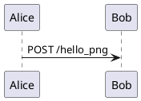
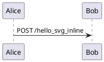
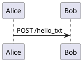

# docker.io/hugojosefson/markdown

Renders markdown syntax to html syntax.

# Usage

Pipe html contents into the process, and you will get html as output.

## Examples

Render `README.md` as html using this
[Docker](https://docs.docker.com/get-started/get-docker/) container:

```bash
cat README.md | docker run --rm -i docker.io/hugojosefson/markdown > README.html
```

Explore the [Docker](https://docs.docker.com/get-started/get-docker/) image
manually:

```bash
docker run --rm -it --entrypoint=bash docker.io/hugojosefson/markdown
```

## Configuration

Optional environment variable(s) to set via `docker run --env ...`:

| name                   | value    | consequence                                                                                                                                                                                       |
| :--------------------- | :------- | :------------------------------------------------------------------------------------------------------------------------------------------------------------------------------------------------ |
| `LINK_README_TO_INDEX` | `"true"` | Renames relative links to files named `README.md` or `README.markdown` (case-insentitive) to `index.html`. You must output rendering of `README.md` files, to files named `index.html`, yourself. |
| `LINK_INDEX_TO_DIR`    | `"true"` | Renames relative links to files named `index.html` (case-insentitive) to just the directory they are in. Use this to get nicer looking links, if your web server supports it.                     |

# Sample content

## Sample PlantUML

These examples use [PlantUML](https://plantuml.com/).


```plantuml
@startuml
Alice -> Bob : POST /hello_png
@enduml
```


```plantuml format="svg_inline"
@startuml
Alice -> Bob : POST /hello_svg_inline
@enduml
```


```plantuml format="txt"
@startuml
Alice -> Bob : POST /hello_txt
@enduml
```

## Sample GitHub Flavoured Markdown

```markdown
- [ ] todo
- [x] done
```

...becomes...

- [ ] todo
- [x] done

# Development

## Format and test

Local development uses
[Deno](https://docs.deno.com/runtime/getting_started/installation/),
[GNU Make](https://www.gnu.org/software/make/), and
[Docker](https://docs.docker.com/get-started/get-docker/). Run these checks
before pushing changes:

```bash
deno fmt
make test
```

`make test` builds `docker.io/hugojosefson/markdown:latest` and runs the
source-artifact unit tests. The
[Docker](https://docs.docker.com/get-started/get-docker/) build renders
[README.md](README.md), [fixture.md](fixture.md), and
[link-rewriting.md](link-rewriting.md), then shows a unified diff if an expected
HTML fixture differs.

Changes to source-artifact publication should also pass the local registry test.
It requires [Docker](https://docs.docker.com/get-started/get-docker/) and
[ORAS](https://oras.land/docs/installation):

```bash
make source-integration-test
```

## Update expected fixtures

Only update fixtures when the renderer's changed output is intentional:

```bash
make fixtures
```

The link-rewriting fixture enables both link-rewriting environment variables.

Refresh the GitHub API comparison fixtures separately. This uses existing
[GitHub CLI](https://cli.github.com/) (`gh`) authentication:

```bash
make gh-api-fixtures
```

## Update GitHub styles

Only use this when upgrading the vendored GitHub Markdown CSS:

```bash
make update-css
```

[github-markdown.css](github-markdown.css) currently vendors
[github-markdown-css v5.9.0](https://github.com/sindresorhus/github-markdown-css/releases/tag/v5.9.0),
including automatic light/dark `prefers-color-scheme` support. The update
command discovers the latest stable release, resolves its tag to an immutable
commit, recalculates hashes, stages the versioned notice and provenance for
review, and regenerates local and GitHub API fixtures. It requires existing
[GitHub CLI](https://cli.github.com/) (`gh`) authentication for the GitHub API
fixture refresh. Review the diff.

## Run CI locally

Requires [Docker](https://docs.docker.com/get-started/get-docker/),
[act](https://nektosact.com/installation/index.html), and existing
[GitHub CLI](https://cli.github.com/) (`gh`) authentication with a token usable
by the workflow:

```bash
make ci-local
```

## Update dependency notices

Use this after changing a dependency version. Notice provenance and checksums
live in [third-party-license-sources.tsv](third-party-license-sources.tsv).

Download only the notice set for review:

```bash
./download-third-party-licenses.sh --notices-only
```

Omit `--notices-only` to also download the listed source archives:

```bash
./download-third-party-licenses.sh
```

The script verifies every download and refuses to overwrite a changed review
file. The image stores the project license and approved dependency notices under
`/usr/share/licenses/markdown/`.

## Inspect corresponding-source inputs

Use this when changing the image's packages or source-artifact workflow. It
queries both platforms without downloading source files:

```bash
make source-inventory \
  SOURCE_IMAGE=docker.io/hugojosefson/markdown@sha256:<index-digest>
```

The input must be a published multi-platform index because a native local build
does not provide both platforms.

Validate a collection request without downloading sources:

```bash
./source-artifact.sh collect \
  docker.io/hugojosefson/markdown@sha256:<index-digest> \
  vX.Y.Z source-artifact --dry-run
```

[SOURCE.md](SOURCE.md) documents artifact retrieval and verification.

# Release

## Prerequisites

Releases require these GitHub repository secrets:

| Secret               | Purpose                     |
| :------------------- | :-------------------------- |
| `DOCKERHUB_USERNAME` | Docker Hub account name     |
| `DOCKERHUB_TOKEN`    | Docker Hub publishing token |

Pull requests and branch pushes run the test job without publishing.

## Publish a version

Use [Git](https://git-scm.com/downloads) to push a semantic version tag after
its commit passes CI:

```bash
git tag vX.Y.Z
git push origin vX.Y.Z
```

The tag publishes
[`docker.io/hugojosefson/markdown`](https://hub.docker.com/r/hugojosefson/markdown)
with semantic version tags and `latest`. The image index includes an SBOM and
provenance attestation.

## Corresponding source

The release job attaches a corresponding-source OCI artifact to the published
image index. It applies these retention tags:

```text
source-vX.Y.Z
source-sha256-<64-hex-index-digest>
```

Each source archive or sdist uses a separate OCI layer, allowing unchanged blobs
to be reused across releases. See [SOURCE.md](SOURCE.md) for retrieval and
verification commands.

Source collection starts after the runtime image is published. A collection or
attachment error therefore fails the release job after the runtime image may
already be visible.

_Acknowledgements: This project wraps
[mikitex70/plantuml-markdown](https://pypi.org/project/plantuml-markdown/),
[markdown-checklist](https://pypi.org/project/markdown-checklist/),
[pymdown-extensions](https://pypi.org/project/pymdown-extensions/),
[Pygments](https://pypi.org/project/Pygments/), and
[github-markdown-css](https://github.com/sindresorhus/github-markdown-css) into
an [Alpine Linux](https://alpinelinux.org/)
[Docker](https://docs.docker.com/get-started/get-docker/) image. I forked this
originally from
[kerhac/plantuml-markdown-docker](https://github.com/kerhac/plantuml-markdown-docker)._
